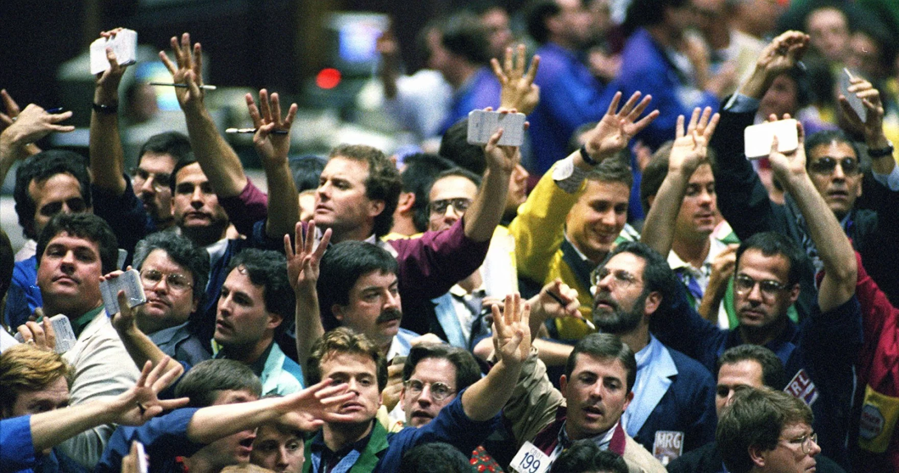

# Exchange

The spot market: Exchange Now  
The futures market: Exchange Later  
The options market: Exchange Later, conditionally  

## Exchanges Now — The Spot Market

The "Spot" Market, or simply the "market", is where people gather, physically or virtually, to perform exchanges of present, readily available assets (for example: shares, bonds, commodities, forex, cryptocurrency), for other present assets.

The asset on one side of the exchange is always a general medium of exchange, i.e. money[^15]. People who desire to exchange money for another asset are called buyers. People who desire to exchange an asset for money are called sellers. Given that money is always one side of the exchanged assets, having two distinct words, "buy" and "sell", helps us remember which way the money is transferred, and which (opposite) way the other asset is transferred, but it is also the source of much confusion, especially when it comes to derivatives[^16]. Hence, we should not forget that the role of a "buyer" and a "seller" is entirely symmetric and equivalent when we consider the transaction as simply an "exchange", rather than an act of "buying" or "selling".

The ratio of money exchanged, for a specific quantity of another asset, is called the price. For example, if 5 ounces of gold are exchanged for $10,000, then we say that the price of gold, as manifested in that exchange, is $2,000/ounce.

Exchanges are voluntary. Someone only enters an exchange when, and if, the terms of it appear favorable. Since this applies to everyone, we can say that an exchange takes place only when both parties view it (simultaneously!) as favorable to them, at least at the time when the exchange is agreed to. This is very much similar to every day transactions, like buying bread. The bread maker has too much of it, and prefers to exchange it for money. The consumer has too little of it, and prefers giving up a little quantity of his available money, in exchange for bread.

The exchanged assets can be later exchanged again in reverse direction (don't try this at your local bakery), possibly at a different price, i.e. at a different ratio of one against the other. This will reveal that, at least in that moment in time, one of the parties lost money by the previous transaction, while the other gained from it. For example, assume someone buys one bitcoin for $50,000, and later sells it (not necessarily to the same person) for $55,000. Then, basic accounting reveals that he made a profit of $5,000, i.e. through exchanges he now possesses more money than he started with. Someone else started with one bitcoin, sold it for $50,000, then bought it back for $55,000. That person possesses $5,000 less than before made a loss of $5,000.

Notice that it's not necessary that the $5,000 loss falls on the initial seller. It could very well be the case that he bought back one Bitcoin for $50,100 (incurring a loss of only $100), and whoever sold for $50,100 later bought back for $50,200 (again incurring a loss of only $100), and so on. Whether though it was a single person losing $5,000, or 50 people losing $100 each, the basic accounting fact remains that the money profit made by one, is born out of an equivalent money loss from the rest of the market participants.

One of the magnificent features of the market economy is the prices established between any money-exchanged asset. To calculate one's money profit or loss, it is not necessary to first sell all the assets back to money, and then count the money. One can at any time mark to market his available assets, and tally them up their money equivalents (i.e. the amount of money he could, at will, exchange them for). For example, an owner of one bitcoin who simply holds it, can rightfully claim that he made a money profit of $5,000, by the mere fact that the price of it was $50,000 and now is[^17] $55,000.

It should be noticed that profit/loss calculations depends on the selection of what the "money" asset is. If the bitcoin holder considered bitcoin to be the money, and dollars to be the "other asset", then he would have made zero profit in terms of bitcoin. It is similar to how an American does not consider it a "profit" if now dollars are exchanged for larger quantities of euros, neither a European would consider it a "loss". But if for some reason the American used euros for money calculations, then the profit (in euros) would be apparent: he would mark-to-market his dollars in euros, and he would discover that he now owns the equivalent of more euros. Symmetrically, the European who would do money calculations in terms of dollars, would discover that he now owns assets that are worth a smaller quantity of dollars than before, hence a loss.

Incidentally, this mark-to-price accounting is what allows for entrepreneurs to estimate the success or failure of their investments: they simply refer their assets back to market prices, and see if their investment grew or diminished in value; whether value was created or destroyed, which is essential in the act of economizing[^18].

## Price Negotiation

This section is rather basic for whoever is already familiar with bids & asks and trading in the spot market; feel free to skip if already familiar with these concepts.

For a spot exchange to happen, all that is needed is that a seller and a buyer find each other and discover that there is a exchange ratio, or a price, to which both agree to exchange a particular quantity of their goods with each other. Then, they exchange immediately the largest quantity they are both willing to exchange in that price, and no future obligation to each other remains.

You don't only want to find anybody that offers a price that you find agreeable - you want the best price. The best price maximizes the quantity of the asset you receive in exchange for what you offer. E.g. in the market of gold and dollars, people who offer dollars seek the maximum quantity of gold for their dollars, while people who offer gold seek the maximum quantity of dollars for their gold.

Since, as we mentioned before, prices are quoted in money, the price could be something like $2000 per ounce of gold. In a typical stock exchange, "XAU" would be the symbol for Gold, and "USD" would be the symbol for dollars. Then, traditionally the quote is named "XAUUSD", i.e. first the non-money asset, with the money asset following. If XAUUSD = $2000, it means "$2000 for a unit of the other asset" (= ounce of gold in this example). In this market, "the price" would refer to the quote of XAUUSD, in dollars.

So, the "best price" for whoever wants to exchange dollars for gold, i.e. buy gold, is the minimum price. Because the price, i.e. "dollars per unit of gold" becomes smaller when the reverse ratio "gold to 1 dollar" is larger, and that maximizes the amount of gold fetched by each dollar.

Similarly, the "best price" for whoever wants to exchange gold for dollars, i.e. sell gold, is the maximum price. Because the price means "dollars per unit of gold", and when it is larger, it maximizes the amount of dollars fetched per unit of gold.

### How do you find the best price?

Imagine your local farmers market. You are a buyer of farmer goods, the farmers are the sellers. The sellers signal their prices via written tags. That is their "ask", i.e. how much money they seek in exchange of a unit of product they offer. They also implicitly signal the size of their offers: the amount of produce in front of them. The price is non-binding if they run out of product! Buyers are expected to walk by, and if they observe an acceptable price for something they want to buy, they go ahead and an mutually acceptable exchange takes place.

This is about the best one can do with physical price tags and with the co-located physical presence of buyers, sellers, and goods. Technology and virtualization though affords us much more efficient markets. Here's how it works:

Unlike the farmer's market, both buyers and sellers can signal the prices that they find agreeable. The price that any particular seller signals as acceptable is called the ask, as we saw above. The price that any particular buyer signals is called the bid. Further, you don't have to walk the entire market to find the best price, or shout to each other, like in the photo below:

A simple computer algorithm maintains these price tags in sorted order tailored for both audiences:
- All asks, in ascending order. The first ask is the cheapest; buyers look at this.
- All bids, in descending order. The first bid is the richest; sellers look at this.

What we think of as the "price" of an asset, is fully characterized by these two prices, the range of the cheapest ask and the richest bid. This is what means by saying "the price is controlled on the margin". It doesn't matter whether millions investors think that their $AAPL shares are worth $300 and don't sell them cheaper than that, and it doesn't matter that other millions investors think that they will buy $AAPL when it "dips" to $100 per share and don't pay a dime more. At the moment of writing, there is someone who tries to buy $AAPL for $169.98 per share (and there is nobody offering more than that), and there is someone who tries to sell $AAPL for $170.00 (and there is nobody seeking less than that). Hence the "price" is somewhere between $169.98 and $170.00.

Unlike the farmers' market, you have to be a bit more explicit with the size. Each bid/ask comes with a precise quantity of assets that the participant is willing to exchange. That means that one can also see at a glance what quantities of what asset are immediately available at what price.

A buyer and a seller signal their willingness to exchange a quantity of an asset at a given price (or better) via what is known as a limit order. They are called "limit" because they only limit the price in one direction (you won't complain if someone offers to you even more versus what you were seeking!).

- **Bid** = limit buy order = "I'm buying quantity $\le$ SIZE at price $\le$ LIMIT"
- **Ask** = limit sell order = "I'm selling quantity $\le$ SIZE at price $\ge$ LIMIT"

Examples of limit orders:
- "I'm willing to buy 0.5 bitcoin at a price of at most $50,000 each"
- "I'm willing to sell 2 bitcoins at a price of at least $60,000 each"

In these examples, $50,000 and $60,000 are called the "limit" of each respective limit order. Hence, one can see that limit orders come in the varieties of limit buy orders, and limit sell orders, indicating as usual the direction of money in the intended exchange.

There's a common order type, called **market order**. This is simply a limit order, where the limit is effectively $+\infty$ for a limit buy order (meaning: you buy at the best available price, whatever that price happens to be, without any limit), or it is zero for a limit sell order (meaning: you sell at the best available price, whatever that happens to be, without any limit).

At any given time, a modern spot market offers these two sorted sets of orders, the bids and the asks. Collectively they are known as the **order book**. The order book only contains *unsatisfied*, or "unfilled" orders (orders that find a counterparty are respectively said to be "filled"). Why is that? Because orders that become satisfiable execute (thus disappear) instantly.

For example, if I make a bid at $60,000 for 0.5 bitcoin, and you make an ask at $50,000 for 0.1 bitcoin, it means I'm already willing to buy your 0.1 bitcoin at a better price that your minimum selling price. Thus 0.1 bitcoin changes hands, for a price between $50,000 and $60,000 (let's assume this is the mid price, $55,000), thus what now remains in the order book from the previous orders, are:
- A bid at $60,000 for 0.4 bitcoin (initially wanted 0.5 but already bought 0.1 bitcoin...)
- No ask (the previous ask was fully exhausted; 0.1 bitcoin sold)

An equivalent way to say that the order book always contains "unsatisfied" orders is to say that the "ask" price is always higher than the "bid" price. The two prices where the asset can instantly be sold and bought, respectively.

It is common to describe a market situation with a single price instead of two: the middle point, or mid point for short, which is the average of the best bid and best ask:

$$\text{MidPoint} = \frac{\text{Bid} + \text{Ask}}{2}$$

This price is not immediately marketable (contrast to "market orders" mentioned above!), i.e. you cannot instantly perform an exchange at that price. You can post a limit order and wait.

If one attempts to immediately exchange a quantity of an asset, he will either use the bid or the ask. The difference between the mid point and either the bid or the ask (it's the same distance to either) is also called **slippage**: it represents something similar to a "transaction cost": you are actually getting a worse price that what the mid point was telling you, as if you are paying extra fees. Furthermore, if your order is large enough, exhausting the size of the best bid or ask, you would then exchange with the second best bid or ask, and so on, meaning progressively worse and worse exchange price. The availability of many competing buyers and sellers in a market manifests as small spreads, and slippage.

Another number sometimes mentioned is the spread (the **"bid-ask spread"** more specifically, because "spreads" also mean something else in options trading). It is simply the difference:

$$\text{Spread} = \text{Ask} - \text{Bid}$$

The absolute value of this number is not important; what is more important is the spread as a ratio (or a percent) against the mid point:

$$\text{Spread}(\%) = \frac{\text{Spread}}{\text{MidPoint}}$$

E.g. if the spread(%) is 1%, it means that you pay 0.5% cost per transaction, so to complete a hypothetical exchange roundtrip (you buy something and immediately sell it back), you would pay 1%, thus retain only 99% of your initial capital.

---

## Exchanges In The Future — The Futures Market

Settlement  
Time Value  
"Pure" Futures  
Interest Rates  
"Perpetuals Futures"  

Futures could have strikes, but don't, due to daily settlement (which resets/equalizes the strike price of all futures)

Interest rate should be explained using Fetter's theory:
Frank Fetter's *Pure Time Preference Theory* explains interest not as a monetary phenomenon or a return on capital goods, but as an inescapable category of human action. Present goods are systematically valued more highly than otherwise identical future goods (time preference). The market interest rate is simply the price ratio resulting from the exchange of present goods for future goods — the discount that future goods suffer relative to present ones. In futures markets, this discount/premium directly shapes the spread between spot and delivery prices.

## Optional Exchanges In The Future — The Options Market

The Oldest Record Of An Option

[^15]: This is the characteristic feature of the market economy compared to the primitive and highly inefficient barter economy. See Menger's *On The Origins Of Money* for more information.
[^16]: One can trade derivatives of negative value as we will see. So one can "buy X" for -$50, but that's equivalent to "sell X for $50", and must not be confused with "buy $X for $50" or "sell X for -$50). When in doubt, focus on what is being exchanged, for what.
[^17]: Note that the price of each completed exchange is actually historical; it refers to the past. Nothing guarantees that the next price will be identical. We will soon clarify what it means to talk about the "current price".
[^18]: It is also the reason why the phrase "Socialist economy" is necessarily a contradiction in terms. If capital goods are publicly owned, there are no prices for them (reflecting their competing employments by entrepreneurs, as driven by consumer demand), hence they can't be "marked-to-market", thus it is not possible to estimate even after the fact whether any particular venture succeeded or failed, let alone calculate beforehand a successful venture.