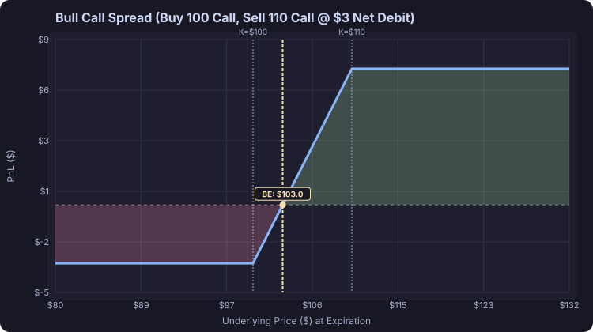

# Introduction

## Visualizing Position Payoffs

Understanding options requires clear visual models of PnL (Profit and Loss) at expiration point across any underlying asset price.

Below is an example payoff diagram of a **Bull Call Spread** generated directly from our position analyzer engine:

### Position Key Metrics
- **Long Leg**: Buy $100 Call @ \$5.00
- **Short Leg**: Sell $110 Call @ \$2.00
- **Net Cost / Max Risk**: \$3.00 (\$300 total)
- **Max Profit**: \$7.00 (\$700 total)
- **Breakeven Point**: \$103.00

### Intrinsic Value Functions at Expiration

For an underlying asset price $S$ at expiration:

- **Call Option Intrinsic Value**:
  $$V_{\text{call}}(S) = \max(S - K, 0)$$

- **Put Option Intrinsic Value**:
  $$V_{\text{put}}(S) = \max(K - S, 0)$$

When combined with position sizing and entry premiums $P$, the Net Payoff $\Pi(S)$ for a single long call position becomes:

$$\Pi_{\text{long call}}(S) = \max(S - K, 0) - P$$

<!-- 
Limit orders
Markets orders like limit orders.

You need this so in the next chapter, you show that options are like promised limit orders

-->